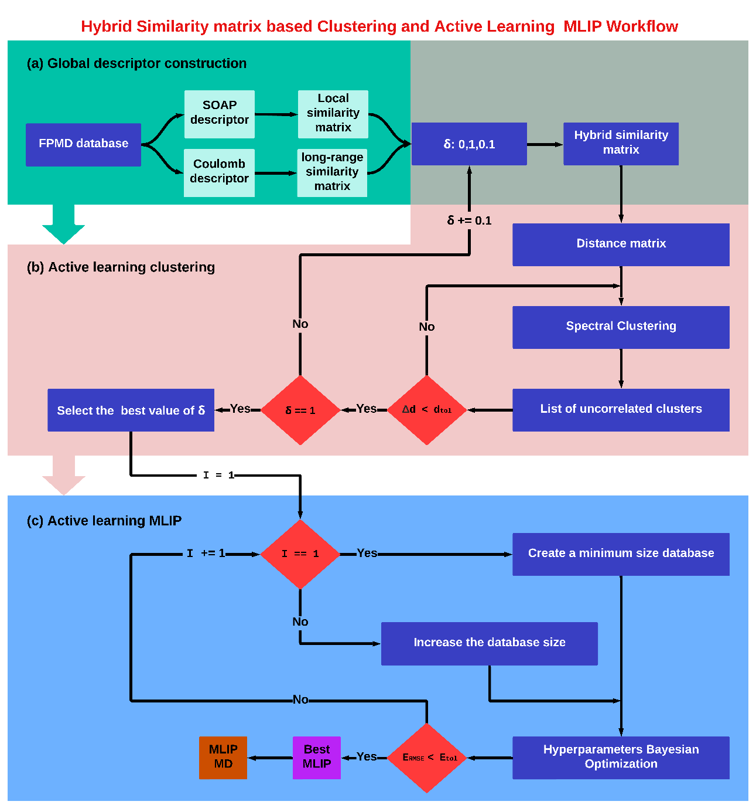

#                                                                   MK-CAMLIP
Multi-kernel Clustering of Amorphous systems and Machine-Learned Interatomic Potentials by active learning.

**MK-CAMLIP** is copyrighted (2021-2024) by Firas Shuaib, Guido Ori, Philippe Thomas, Olivier Masson, and Assil Bouzid. It is delivered with additional codes that it depends on for part of its functionality, but  are not copyrighted by the **MK-CAMLIP** developers. They are provided for the user's convenience and in conformity with their respective licenses/terms of use.

Clone the  **MK-CAMLIP**  repository:

	git clone --recursive https://github.com/ASM2C-group/MK-CAMLIP.git

**MK-CAMLIP** workflow developed as a part of the article "Multi-kernel similarity-based clustering of amorphous systems and machine-learned interatomic potentials by active learning", and was applied to several glassy systems including, AsTe3, TeO2, and TeO2+gamma crystal (For more information, refer to Ref.[article])
 
Please cite the following paper, when **MK-CAMLIP** routines are used:
```
"..........................................................................."

```




## Installation

### Prerrequisites

- A Fortran compiler  (successfully tested with `gfortran`)
-  ase 
- numpy
- matplotlib
- scipy
- scikit-learn
- os
- SpectralClustering
- shutil 
- itertools 10.4.0
- dscribe==1.2.2
- subprocess
- copy
- MDS
- random
- pip 
- GPyOpt 1.2.6
- QUIP (for more details: http://libatoms.github.io/QUIP/)
After compiling the QUIP libraries, please provide the whole path of the `quip` and `gap_fit` binary files to "gap_setup" function in your 'Functions.py' python file. The current *MK-CAMLIP* is compatible with the QUIP version but can be also used with the paralell version. 


## Description of *MK-CAMLIP* workflow
*MK-CAMLIP* workflow cotains three main parts:

**A/ Global descriptor construction:** Given an MD trajectory, a global similarity kernel is constructed to create a similarity matrix between the different configurations in the dataset **(see Fig. MK-CAMLIP.png (a))**, based on either an averaged measure of the local atomic environments or long-range interactions as follows:
- For two configurations with $𝑁_{𝐴}$ and $𝑁_{𝐵}$ atoms, the SOAP similarity between all pairs of atoms in the two configurations is calculated, which results in a pairwise similarity matrix. This matrix is then averaged to obtain a single similarity measure for the two configurations (see Fig.**Hyb_similarity.png**).
- The process is repeated for all configurations, resulting in an average SOAP similarity matrix of size 𝑁×𝑁, where 𝑁 is the number of configurations.
- The same approach is applied using the Coulomb matrix to account for long-range interactions, providing a global similarity measure.
  
  
  
- A hybrid kernel approach is introduced, combining the SOAP and Coulomb kernels. This approach leverages both local and long-range descriptions, with a user defined hyperparameter $\delta$, determining the relative weight of each kernel. 
  
 $$                  K_{Hybrid}(A,B) = (1-\delta)\times K_{SOAP}(A,B) + \delta \times K_{Coulomb}(A,B) $$
 
- The hybrid similarity kernel enables the construction of a global similarity matrix between all configurations within a given dataset, and can be coverted into a distance measure that can subsequently be used to classify the dataset into clusters of structurally similar configurations.
  
 $$                                                                    D(A,B) = \sqrt{2-2K_{Hybrid}(A,B)} $$

 **B/ Active learning clustering:** The optimum value of $\delta$ can be automatically determined by resorting to an Active learning scheme **(see Fig. MK-CAMLIP.png (b))**, which works as follows:
 - The distance matrix is used as input for the Spectral Clustering algorithm that will output a set of clusters containing similar configurations. The Spectral Clustering algorithm runs iteratively by increasing the number of target clusters until the average distance between clusters reaches a specified threshold, $𝑑_{𝑡𝑜𝑙}$. This process is repeated for all values of $\delta$, ranging from 0 to 1 with a step of 0.1.
 - Since $\delta$ is chosen arbitrarily, its optimal value must be determined for an effective classification. This is done by calculating the standard deviation of the energies within each cluster for a given $\delta$, then averaging these deviations across all clusters.
 - The ideal $\delta$ value corresponds to the lowest average standard deviation, indicating minimal energy dispersion within clusters, which suggests a more accurate classification of the configurations.

 **C/ Active learning MLIP:** After achieving a list of uncorrelated clusters whether with a user defined/tuned $\delta$, or with a $\delta$ achieved thtough the active learning scheme, GAP Machine Learning Interatomic Potential (MLIP) can be fitted in an active learning loop. The active learning scheme is designed to create (i) a minimal size dataset (ii) while optimizing GAP hyperparameters **(see Fig. MK-CAMLIP.png (c))**.
- This involves selecting a fraction ($I_{perc}$) of configurations to be extracted from each cluster to build the smallest database, representative of the original dataset's structural variety.
- The selected database is divided into a training set (70%) and a test set (30%). The training set is used to train the GAP model, while the test set evaluates the model's accuracy by calculating the Root Mean Square Error (RMSE) of the predicted energies against reference Molecular Dynamics (MD) data.
- The GAP model uses a combination of SOAP and two-body distance descriptors, excluding the Coulomb matrix, which is used only for clustering.
- The model's hyperparameters are fine-tuned using Bayesian Optimization (BO), which employs a surrogate model to explore the hyperparameter space and minimize prediction errors.
- BO proceeds in two phases: exploration, where the surrogate model is built based on an error metric, and exploitation, where this model guides the selection of hyperparameters to refine the GAP model. The RMSE on the test set measures the deviation of predicted energies from the MD reference data.
- If the optimized GAP model does not meet the energy convergence threshold ($E_{tol}$), another active learning iteration begins, increasing the database size by $n$. This iterative process continues until the RMSE meets or falls below $E_{tol}$, or the database reaches its maximum size, resulting in an optimal, minimal training dataset and fine-tuned GAP hyperparameters.

*MK-CAMLIP*  workflow (images/MK-CAMLIP.png) is described in details in "Multi-kernel similarity-based clustering of amorphous systems and machine-learned interatomic potentials by active learning" article (**read more at [article]**).


# How to run the *MK-CAMLIP*  workflow ?

First, input parameters should be defined in the 'Gap_fit.py' file. Second, the "gap_setup" function in 'Functions.py' file should be modified accorrding to the specificities of studied system. Third, the path of the `quip` and `gap_fit` binary files must be correctly defined in this fuction. Finally, the workflow can be executed through the command "python3 Gap_fit.py".

**Warning:** *MK-CAMLIP* should not be executed on desktop as a large RAM memory is required. Typically, a HPC node with at least 1 To RAM is required. A submittion script for HPC Mésocentre de Calcul Intensif Aquitain (MCIA) is providid in "script.sh" file.

## Acknowledgements
This work was supported by the French ANR via the AMSES project (ANR-20-CE08-0021) and by région Nouvelle
Aquitaine via the CANaMIAS project AAPR2021-2020-11779110. Calculations were performed by using resources from
Grand Equipement National de Calcul Intensif (GENCI, projects No. A1X0910832, A1X0913426 and A1X0914978). We used computational
resources provided by the computing facilities Mésocentre de Calcul Intensif Aquitain (MCIA) of the Université de Bordeaux
and of the Université de Pau et des Pays de l’Adour.
